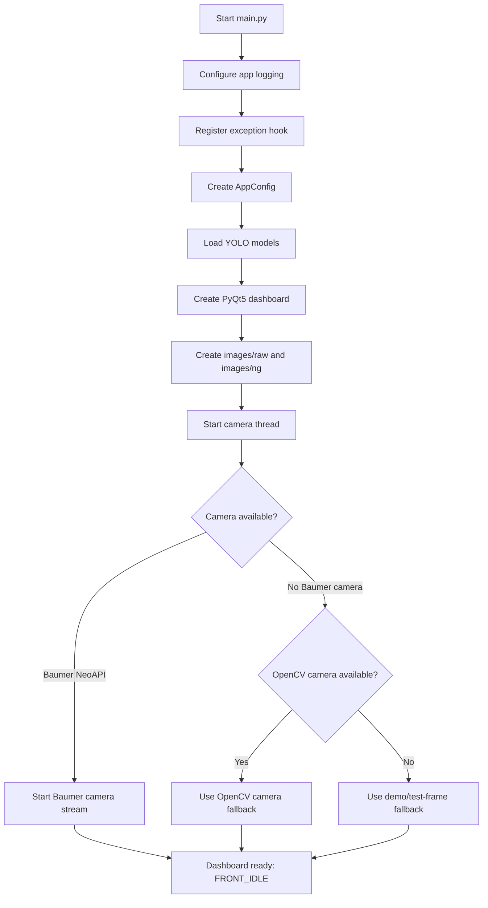
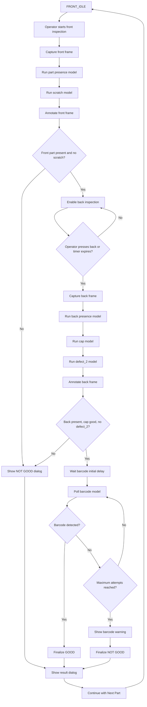
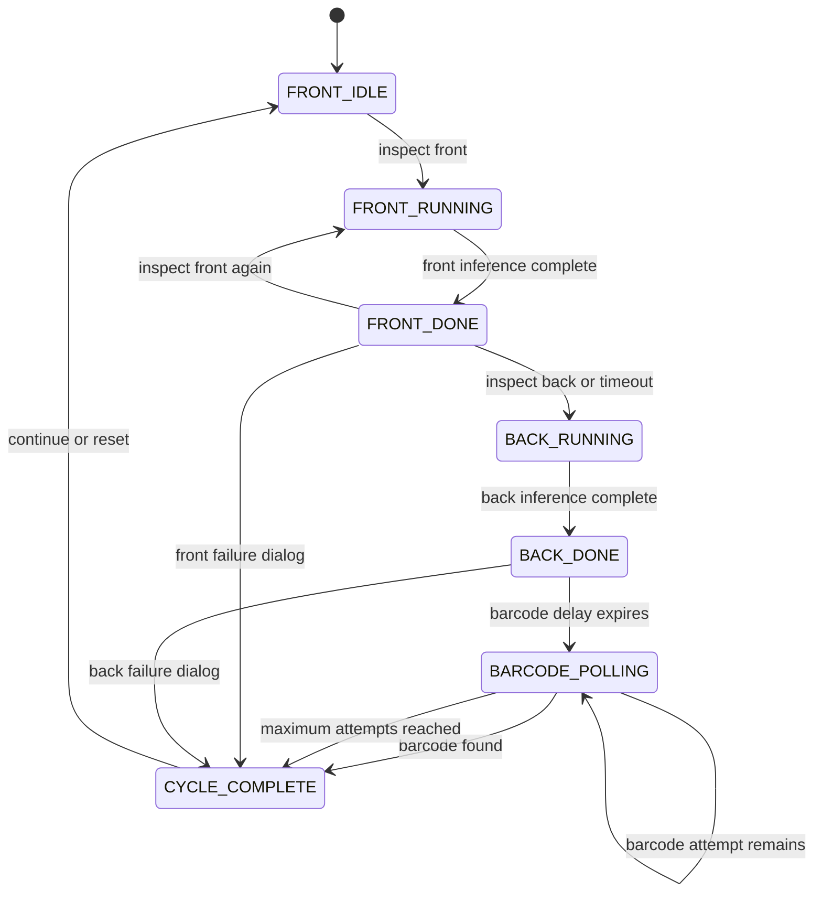

# MOTHERSON Automotive Visual Inspection Platform

## 1. Purpose

The MOTHERSON application is a desktop PyQt5 inspection station for automotive parts. It captures images from a Baumer industrial camera, runs several YOLO object-detection models, annotates the image with detections, and guides an operator through a multi-stage inspection cycle.

Each part is inspected in this order:

1. Front module inspection.
2. Back module inspection.
3. Barcode polling.
4. Final GOOD or NOT GOOD result.
5. Reset for the next part.

The application can also run in a demonstration mode when a physical camera or one of the optional models is unavailable.

## 2. Application Architecture

| File | Responsibility |
| --- | --- |
| `main.py` | Application entry point, startup logging, exception handling, model initialization, and UI launch. |
| `config.py` | Central application, camera, model, timing, storage, and ROI configuration. |
| `ui.py` | PyQt5 dashboard, controls, timers, camera event handling, image display, dialogs, and metrics. |
| `baumer_cam.py` | Camera connection, NeoAPI streaming, OpenCV fallback, software triggering, and camera cleanup. |
| `detection.py` | YOLO model loading, inference, detection conversion, and bounding-box annotation. |
| `vision_engine.py` | High-level wrapper around the multi-model detection engine. |
| `inspection_state.py` | Inspection state machine, front/back/barcode decisions, defect aggregation, and cycle reset. |
| `model/motherson/*.pt` | YOLO model files used by the inspection pipeline. |
| `images/raw/` | Created at startup as a raw-image output directory. |
| `images/ng/` | Created at startup as a not-good-image output directory. |
| `app_log.txt` | Receives application stdout and stderr output. |

## 3. Startup Procedure

The startup sequence is:

1. Python starts `main.py`.
2. `main.py` opens or appends to `app_log.txt`.
3. Standard output and standard error are duplicated to the console and log file.
4. An uncaught-exception handler is registered.
5. An `AppConfig` object is created with:
   - Company: `MOTHERSON`
   - Application: `Automotive Visual Inspection Platform`
6. `VisionEngine` creates a `DetectionEngine`.
7. The detection engine loads the following models:
   - `scratch.pt`
   - `cap.pt`
   - `defect_2.pt`
   - `presence.pt`
   - `barcode.pt`
8. The PyQt5 window is created.
9. The output directories are created if they do not exist.
10. The camera thread starts and attempts to connect to the camera.
11. The dashboard opens in `FRONT_IDLE` state.

A model that cannot be loaded is recorded with an error and returns no detections. The other models can still load and run.



## 4. Dashboard Layout

### 4.1 Top bar

The top bar contains:

- Camera label showing the configured camera type.
- Trigger mode selector.
- Current inspection phase badge.
- `Reset Cycle` button.

The trigger mode selector contains:

- `Software Trigger Mode`
- `Continuous Live Feed`

### 4.2 Left control panel

The left panel is scrollable and contains:

- MOTHERSON title and application name.
- Good-parts metric.
- Bad-parts metric.
- Fail-rate metric.
- Inspection workflow controls.
- Model parameter controls.
- Baumer camera parameters.
- ROI controls.
- Camera status text.

### 4.3 Right preview panel

The right panel contains:

- `Live Feed / Inspection Preview` heading.
- Barcode warning banner.
- Camera or inspection image.
- Yellow interactive ROI rectangle while ROI drawing is active.
- Current status text.

The displayed image is scaled to fit the preview area while maintaining its aspect ratio. The original image dimensions are retained for ROI coordinate conversion.

## 5. Workflow Controls

### Inspect Front Module

Starts the front inspection. If a camera is connected, the application sends a software trigger and waits for the captured frame. If a trigger cannot be sent, the latest frame or a generated test frame is used.

The front inspection runs:

- Part-presence model.
- Scratch model.

### Inspect Back Module

Available after the front inspection completes successfully. It captures another frame and runs the back inspection models.

The back inspection runs:

- Part-presence model.
- Cap model.
- `defect_2` model.

### Soft Trigger

Sends a camera software trigger. The inspection action associated with the current cycle state determines whether the captured frame is used for front or back inspection.

### Infer Local Image

Opens a file picker for PNG, JPG, JPEG, or BMP images. The selected image becomes the current frame and is sent through the current inspection stage:

- Front stage: runs front inspection.
- Later stages: runs back inspection.

This is intended for offline testing without a live camera.

### Reset Cycle

Stops active timers, hides the barcode warning, resets the inspection state to `FRONT_IDLE`, clears cycle results, and makes the front inspection available again.

## 6. Camera Operation

### 6.1 Baumer NeoAPI connection

The camera thread first tries to import NeoAPI and connect to a Baumer camera. If successful, it applies:

- Trigger mode.
- Exposure time.
- Gain.

For a Baumer camera, frames are acquired with `GetImage`. Mono or Bayer frames are converted to BGR before being sent to the UI.

### 6.2 OpenCV fallback

If NeoAPI cannot connect, the application tries `cv2.VideoCapture(0)`, first with the Windows DirectShow backend and then with the default OpenCV backend.

When OpenCV is used:

- The camera is treated as a normal video source.
- Frames are emitted at approximately 30 FPS.
- A software trigger reads and emits one frame immediately.

### 6.3 No-camera/demo behavior

If neither Baumer nor OpenCV can provide a frame:

- The camera status reports demo/disconnected mode.
- The UI can use a generated test frame containing `MOTHERSON TEST FRAME`.
- Missing part-presence model output is treated as part present.
- Missing barcode model output can produce a generated demo barcode after two polling attempts.

This fallback is useful for demonstrations but must not be treated as production inspection evidence.

### 6.4 Trigger modes

#### Software Trigger Mode

The preview is not continuously updated as an inspection result. The operator triggers a capture through an inspection button or the soft-trigger button. The next captured frame is routed to the pending front or back action.

#### Continuous Live Feed

The camera continuously emits frames. The UI displays them while the cycle is in `FRONT_IDLE` or `FRONT_DONE`. Inspection still occurs only when the operator starts an inspection action.

### 6.5 Camera controls

The camera settings card provides:

- Exposure: 100 to 100000, step 100.
- Gain: 0.0 to 30.0, step 0.1.
- `Apply Camera Parameters` button.

Applying the settings updates the runtime configuration and sends the values to the connected Baumer camera when available.

## 7. Model Configuration

The model selector provides:

- `scratch`
- `cap`
- `defect_2`
- `part_presence`
- `barcode`

Each selected model has:

- Confidence threshold from 0.01 to 1.00.
- Inference image size selected from 320, 416, 512, 640, 800, or 1024.

Pressing `Apply Model Setting` updates the selected model configuration and reloads all models.

The configured defaults are:

| Model | File | Confidence | Image size | Inspection use |
| --- | --- | ---: | ---: | --- |
| Scratch | `model/motherson/scratch.pt` | 0.60 | 1024 | Front scratch detection. |
| Cap | `model/motherson/cap.pt` | 0.40 | 640 | Back cap, foam, and missing-cap detection. |
| Defect 2 | `model/motherson/defect_2.pt` | 0.60 | 1024 | Back defect detection. |
| Part presence | `model/motherson/presence.pt` | 0.25 | 640 | Front and back part-presence check. |
| Barcode | `model/motherson/barcode.pt` | 0.25 | 640 | Barcode-region detection and data label selection. |

Every YOLO prediction uses an IoU value of `0.45`.

## 8. Detection and Annotation Rules

The detection engine converts YOLO output into `DetectionItem` records containing:

- Bounding-box position and size.
- Class ID.
- Class name.
- Confidence.
- Source model name.

The annotated preview uses these colors:

| Detection source | Condition | Box color |
| --- | --- | --- |
| `cap` | `cap`, `foam`, or other cap-model item | Green |
| `cap` | `no_cap` or `nocap` | Red |
| `scratch` | Any detection | Red |
| `defect_2` | Any detection | Red |
| `barcode` | Any detection | Yellow/gold |
| `part_presence` | Hidden by default in annotation | Not drawn by default |

Part presence is used for pass/fail logic but its bounding box is intentionally hidden in the normal inspection preview.

## 9. Complete Inspection Procedure

### Step 1: Front module

1. The cycle starts in `FRONT_IDLE`.
2. `Inspect Front Module` is enabled.
3. The operator places the part in the inspection position.
4. The operator clicks `Inspect Front Module` or uses the soft trigger.
5. The application captures the next frame.
6. The part-presence model runs.
7. The scratch model runs.
8. The image is annotated.
9. The status label displays the front result and any defect messages.

The front result is GOOD only when:

```text
part presence detected AND no scratch detections
```

If the front result is BAD, the application immediately opens the result dialog and does not continue automatically to the back module.

If the front result is GOOD, the back button is enabled and an automatic transition timer starts. The configured default is five seconds.

### Step 2: Back module

1. The operator clicks `Inspect Back Module`, or the front timer starts it automatically.
2. The application captures another frame.
3. The part-presence model runs.
4. The cap model runs.
5. The `defect_2` model runs.
6. The image is annotated.
7. The status label displays the back result.

The back result is GOOD only when:

```text
part presence detected
AND no no-cap detections
AND no defect_2 detections
```

If the back result is BAD, the application opens the result dialog immediately.

If the back result is GOOD, the application waits for the barcode phase.

### Step 3: Barcode phase

1. A five-second initial barcode delay starts by default.
2. The application begins barcode polling.
3. A frame is evaluated every one second by default.
4. The barcode attempt counter increases after each inference.
5. Polling stops when a barcode is detected or the maximum attempt count is reached.

The default maximum is ten attempts.

When a barcode detection is returned:

- The first detection is selected.
- Its class name is used as barcode data if it is alphanumeric.
- Otherwise, a generated value in the form `MTH-########` is used.

If no barcode is detected after the maximum attempts:

- The warning banner becomes visible.
- The barcode value becomes `NO BARCODE READ`.
- The cycle is finalized as NOT GOOD.

### Step 4: Final result

The final result dialog shows:

- `GOOD PART` or `NOT GOOD (NG)`.
- Barcode data or `NO BARCODE READ`.
- A pass message or defect list.
- `Continue with Next Part` button.

After the operator presses the continue button, the cycle resets to `FRONT_IDLE`.



## 10. Inspection State Machine

The inspection cycle uses these states:

| State | Meaning |
| --- | --- |
| `FRONT_IDLE` | Ready to start a front inspection. |
| `FRONT_RUNNING` | Front models are being evaluated. |
| `FRONT_DONE` | Front evaluation completed. Back inspection may be started if front passed. |
| `BACK_RUNNING` | Back models are being evaluated. |
| `BACK_DONE` | Back evaluation completed. Barcode phase may begin if back passed. |
| `BARCODE_POLLING` | Barcode attempts are being performed. |
| `CYCLE_COMPLETE` | Overall result has been finalized and is ready for the result dialog. |



## 11. Result and Defect Rules

The final defect list is assembled as follows:

### Front defects

- `Front Module: No Part Present`
- `Front Module: Scratch Defect Detected`

### Back defects

Back defects are included in the final aggregation only when the front checks passed:

- `Back Module: No Part Present`
- `Back Module: No Cap Detected`
- `Back Module: Defect 2 Detected`

### Barcode defect

Barcode failure is included only when:

- Front checks passed.
- Back checks passed.
- At least one barcode attempt occurred.
- No barcode was successfully detected.

The overall result is GOOD when the final defect list is empty. Otherwise it is NOT GOOD.

## 12. Metrics

The dashboard maintains runtime counters:

- `Good Parts`: number of completed GOOD cycles.
- `Bad Parts (NG)`: number of completed NOT GOOD cycles.
- `Fail Rate (%)`: calculated as:

```text
bad parts / total completed cycles * 100
```

The counters are held in memory and are reset when the application is restarted. They are not written to a database or persistent report file.

## 13. ROI Feature

The ROI panel provides:

- ROI X.
- ROI Y.
- Width.
- Height.
- `Draw ROI on Feed` button.

When drawing is enabled:

1. The feed cursor changes to a crosshair.
2. The operator drags a rectangle over the image.
3. The rectangle is converted from displayed coordinates to original image coordinates.
4. Coordinates are clamped to the image bounds.
5. The coordinate controls are updated.

### Current implementation status

The ROI is currently a UI selection feature only. The selected coordinates are not yet used to crop, mask, or otherwise modify frames before YOLO inference. Therefore, changing the ROI does not currently change inspection results.

## 14. Logging and Output Directories

At startup, the application creates:

```text
images/raw/
images/ng/
```

The application also appends console and error output to:

```text
app_log.txt
```

The current code creates the raw and NG directories but does not automatically save every captured frame or NG result into those directories.

## 15. Reset and Shutdown

### Reset

The reset action:

- Stops the front auto-transition timer.
- Stops the barcode delay timer.
- Stops barcode polling.
- Hides the barcode warning banner.
- Clears front, back, barcode, and overall result state.
- Returns the workflow to `FRONT_IDLE`.

### Application close

When the window closes:

1. All timers are stopped.
2. The camera thread is stopped.
3. Baumer streaming is stopped and the camera is disconnected when applicable.
4. The OpenCV capture is released when applicable.
5. The application exits.

## 16. Important Current Limitations

1. **Barcode data is detection-class based.** The code does not perform OCR or decode a conventional barcode string. It uses the first barcode model class name, or generates a demo value when appropriate.
2. **NeoAPI is hardware-specific.** The bundled NeoAPI wheel is Windows AMD64-specific. OpenCV fallback is available when NeoAPI or a Baumer camera is unavailable.
3. **Demo behavior can produce synthetic results.** A missing barcode model can generate a random barcode after two attempts, and a missing part-presence model assumes the part is present.
4. **ROI does not affect inference yet.** It only updates the UI coordinate controls.
5. **Output folders are prepared but not populated automatically.** No image-save operation is currently performed for every raw or NG frame.
6. **Metrics are not persistent.** Good, bad, and fail-rate values disappear when the application closes.
7. **Early front/back failures open the result dialog immediately.** The current result aggregation is primarily finalized during barcode completion or barcode timeout, so early-failure defect details should be verified during production testing.
8. **Model reload reloads all models.** Applying a setting for one model recreates every model engine, which can take time and consume additional memory.

## 17. Typical Operator Procedure

1. Start the application.
2. Confirm the camera status.
3. Select software trigger mode for operator-controlled captures or continuous mode for a live preview.
4. Place the part for front inspection.
5. Click `Inspect Front Module`.
6. Confirm that the front result is GOOD.
7. Present the back side of the part.
8. Click `Inspect Back Module`, or wait for the automatic transition.
9. Attach or position the barcode during the barcode delay.
10. Wait for barcode polling to finish.
11. Review the result dialog and defect details.
12. Click `Continue with Next Part`.
13. Repeat from the front inspection.

For offline testing:

1. Start the application without a physical camera.
2. Click `Infer Local Image`.
3. Select a test image.
4. Run the applicable inspection stage.
5. Review detections and the result dialog.

## 18. Source of Truth

This document describes the behavior currently implemented in:

- `main.py`
- `config.py`
- `ui.py`
- `baumer_cam.py`
- `detection.py`
- `vision_engine.py`
- `inspection_state.py`

When this document differs from a future UI design or production requirement, the executable code and verified production behavior should be treated as the source of truth until the implementation is updated.
